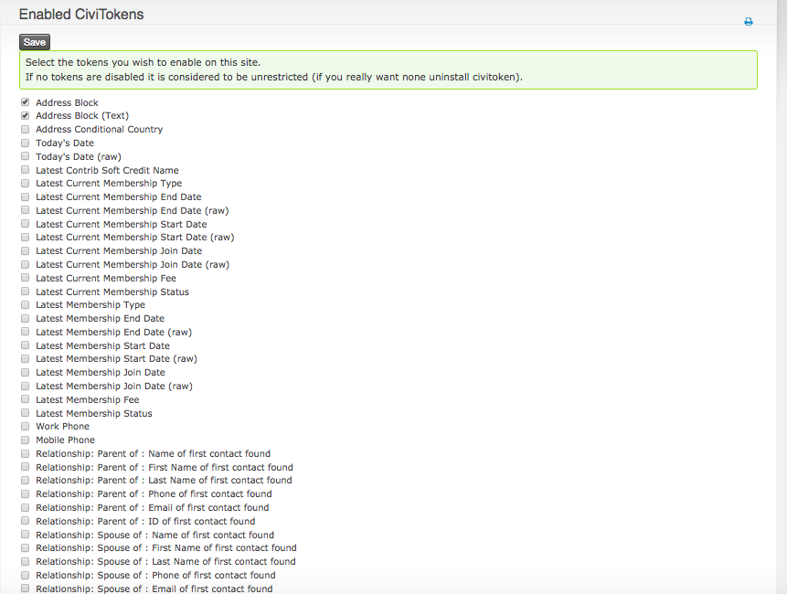
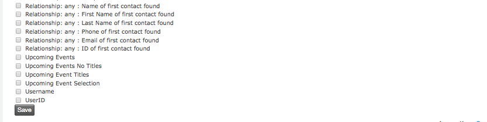

nz.co.fuzion.civitoken
======================

Fuzion Token extension for CiviCRM, that provides its users extra tokens.

These include tokens to access membership data, like membership type, start and end dates, and status. These are particularly useful to use on your "fees due" automatic notices.

By default all tokens are enabled. If you just want some there is a setting page which can be found at /civicrm/a/#/civitoken/settings
(screenshot below).

*A note about country-specific address formatting*
CiviCRM has a data structure to support country-specific address formatting but
no inbuilt functionality to support this.  The [addressl10n](https://github.com/MegaphoneJon/com.megaphonetech.addressl10n) extension provides a user interface to edit country-specific address formats.

*A note about country in the address block*

Several countries postal codes require that the country be excluded if it is a
domestic posting (if you wish to get bulk postal rates), I am not aware
of any where the country IS required for domestic. This extension does not
include the country in the address block if it matches that configured for
the domain organisation.

Installation
-----------

Installing this extension is quite easy. You only have to:

1. Visit your `civicrm/admin/extensions` page
2. See what is your extension directory, or create one if it doesn't exist
3. Go to that directory and `git clone https://github.com/eileenmcnaughton/nz.co.fuzion.civitoken.git`
4. Change permissions and ownership of the new directory, if needed
5. Refresh the `civicrm/admin/extensions` page
6. Click on "install"
